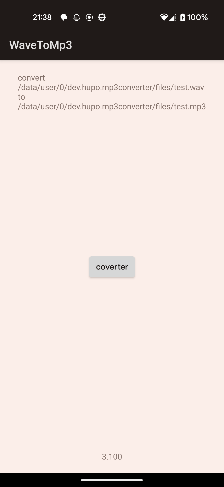

## WavToMp3

这个Android库基于LAME库实现了将WAV音频文件转换为MP3格式的功能。
LAME是一个开源的音频编码库，它提供了高质量的音频压缩和编码算法。
这个库提供了一个简单而强大的接口，让开发者能够轻松地将WAV文件转换为MP3格式，从而在应用程序中实现音频格式的转换和压缩。
使用这个库，你可以将音频文件转换为MP3格式以减小文件大小，并在网络传输或存储中节省带宽和存储空间。
无论是构建音频编辑应用、媒体播放器还是任何其他需要音频转换的应用，这个库都能帮助你轻松地完成任务。



## Use

1. 在构建文件中添加 Maven 仓库。

```groovy
repositories {
    maven { url "https://raw.githubusercontent.com/onehupo/WavToMp3/main/repo/" }
}
```

2. 添加库的依赖项到构建文件中。

```groovy
implementation "dev.hupo.converter:wav2mp3:1.0.0"
```

3. 将.so文件复制到你的Android项目的jniLibs目录下。在

`converter/src/main/jniLibs`

4. 使用以下 Kotlin 代码片段来进行 WAV 转换为 MP3。

```kotlin
val config = Mp3ConverterConfig()
config.setInputFile(wavPath)
config.setOutputFile(mp3Path)
WavToMp3Converter.setListener {
  Log.d("WavToMp3", "progress: $it")
}
WavToMp3Converter.convert(config)
```

其中`Mp3ConverterConfig`中包含了配置信息，需要根据实际情况进行配置

| 字段名 | 类型   | 默认值   | 描述                                |
|--------|--------|----------|-------------------------------------|
| inputSampleRate | 整数   | 16000    | 设置输入音频的采样率（以Hz为单位）。 |
| channels       | 整数   | 1        | 设置输入音频的声道数。              |
| bRate          | 整数   | 128      | 设置输出音频的比特率（以kbps为单位）。|
| outputSampleRate | 整数 | 16000    | 设置输出音频的采样率（以Hz为单位）。 |
| inputFile      | 字符串 | 空字符串  | 设置要进行转换的输入文件的路径。     |
| outputFile     | 字符串 | 空字符串  | 设置转换后的音频文件的输出路径。     |
